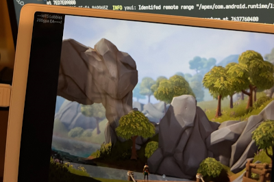
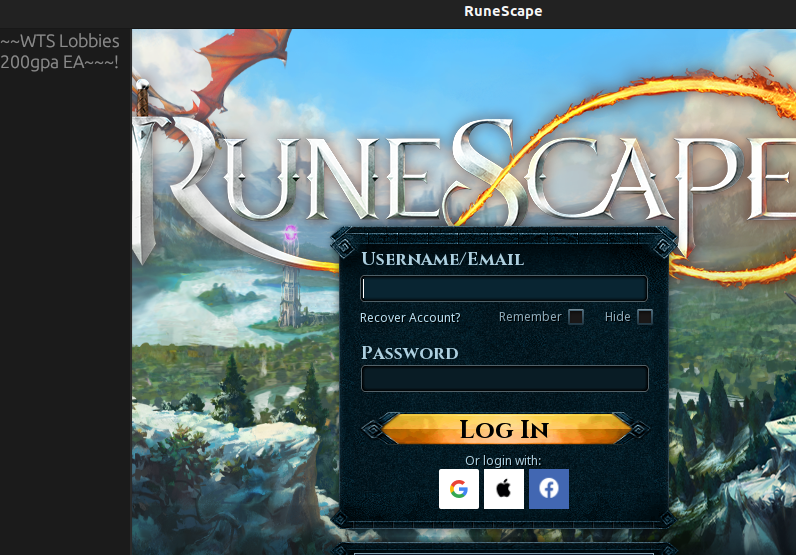
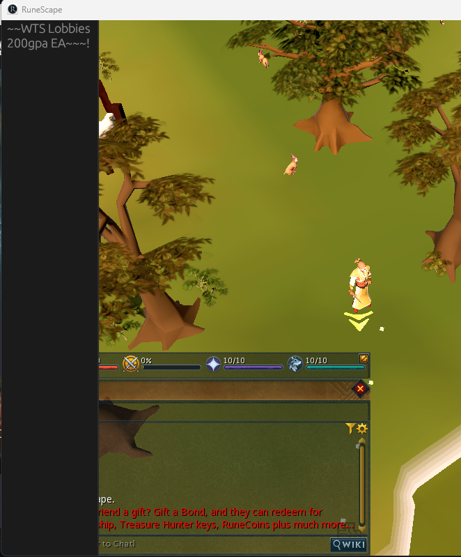

<p align="center">
    
    <h1 align="center"> Selling Lobbies </h1>
</p>

Proof of concept cross architecture, cross operating system internal mod framework for OpenGl powered games. Use case was Runescape 3 because it has a windows, unix, and android distribution.

Supports Windows , Linux, and Android

Powered by Egui / Egui_Glow

## Showcase

<div align="center">
    
    <br>
    
</div>

## Todo

- Do we need egl dependency, or can use egl calls from the link map we hook for eglSwapBuffers
- Support Resize, detecting resize different by os it looks, can't depend on egl or wgl hook.
- Add input handling, easy enough but should make a nicer cross os solution. Hopefully can hijack winit for this somehow
- Mac/iOS support. Need Yami (Yet another macho injector) and Plt/Hooking mechanism. And generally... access to a mac machine lol

---

## Building

```shell
cargo build --target i686-pc-windows-msvc
cargo build --target x86_64-pc-windows-msvc

cargo build --target i686-unknown-linux-gnu
cargo build --target x86_64-unknown-linux-gnu

# most people use cross for these builds... but u get the point
cargo build --target armv7-linux-androideabi
cargo build --target aarch64-linux-android
...
```

## Quick Start

### Windows
Will build and inject the dll into active rs2client.exe;
Cargo installs YAI
```shell
cargo make winject
```
---

### Unix
Will build and inject the shared object into active rs2client;
Cargo installs YAUI
```shell
cargo make uinject
```
---

### Android
Will build and push the shared object to the actively connect android debug device.

Tags the shared object so SELinux will allow mmaping it in an executable range from `/data/local/tmp/payload.so`

Build YAUI for your android device and adb push it to `/data/local/tmp`

Make sure to make it executable `chmod +x yaui`
```shell
cargo make ainject

# something like this idk
adb shell "su -c '/data/local/tmp/yaui --pid `(pidof ...)` --payload /data/local/tmp/libpayload.so'"
```

For android to see logs use logcat; Don't println use tracing always
```shell
adb logcat -s "SellingLobbies"
```

```shell
--------- beginning of system
--------- beginning of crash
--------- beginning of main
... SellingLobbies: payload: Android logging enabled! Layer created with tag `SellingLobbies`
... SellingLobbies: payload: Entering tracing std usage
```

## Shill
If you appreciate this project, please consider taking a look at the backing crates I published to accomplish this.

Contributions to the crates are appreciated and encouraged.

### Yai (Yet another injector)
https://github.com/ohchase/yai

Simple Windows create remote thread load library dll injection

Decent cli support, actually pretty useful for a simple:

```shell
cargo install yai
yai --target Game.exe --payload payload.dll
```

### Ptrace Do 
https://github.com/ohchase/ptrace-do

A crate leveraging ptrace to allow for calling arbitrary remote functions in foreign processes.
Respects all system architectures (`aarch64`, `arm`, `x86`, `x86_64`)

In application, this gives us a comparable debug layer similar to Windows (`ReadProcessMemory`, `WriteProcessMemory`). We can now uses Libc's (`mmap`, `munmap`) for the same effect.

### Yaui (Yet another unix injector)
https://github.com/ohchase/yaui

A crate which utilizes ptrace-do to inject a shared object into a running process. 

Respects all system architectures (`aarch64`, `arm`, `x86`, `x86_64`)

Makes intelligent decisions based on system architecture and operating system (linux/android) to identify correct linker and libc in foreign process for correct injection.

### Plt-Rs
https://github.com/ohchase/plt-rs

A crate which crawls unix link maps at runtime, providing an api to detour imported functions such as `libc::recv`, `libc::send`, `eglSwapBuffers`, `libc::dlopen`.

Respects Android's custom Bionic Linker implementation

Consistent runtime function hooking with a lot of capabilities.
